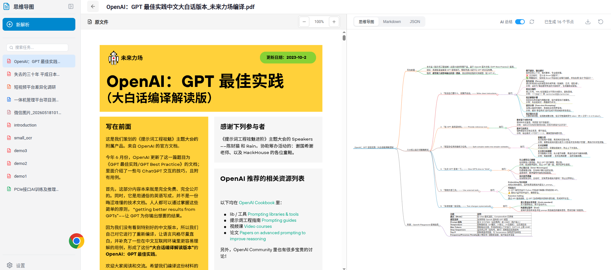
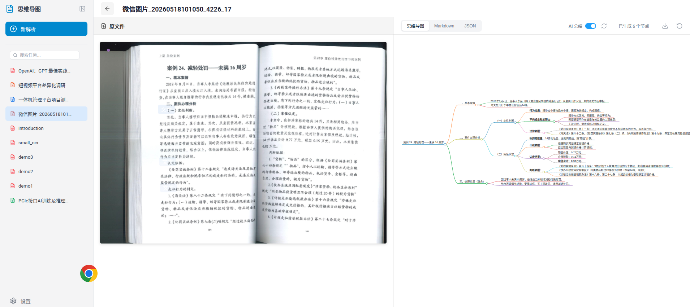
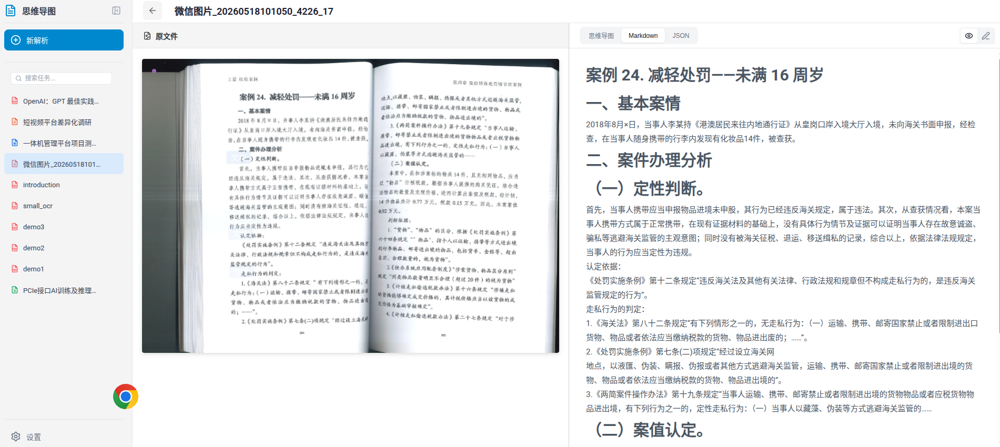
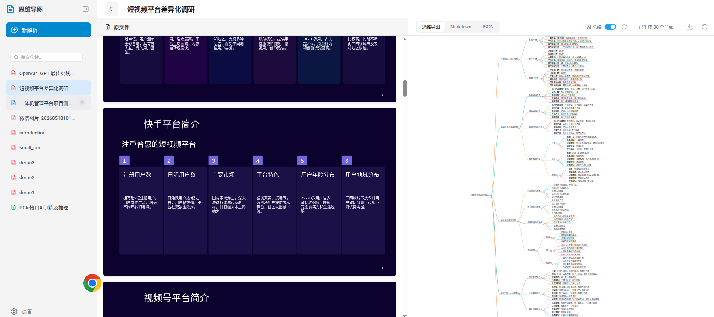
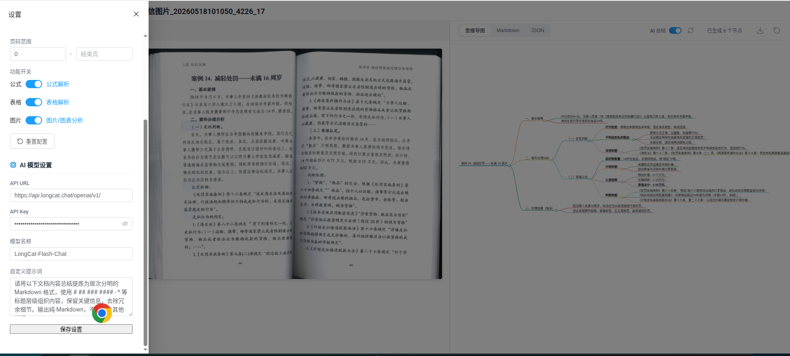
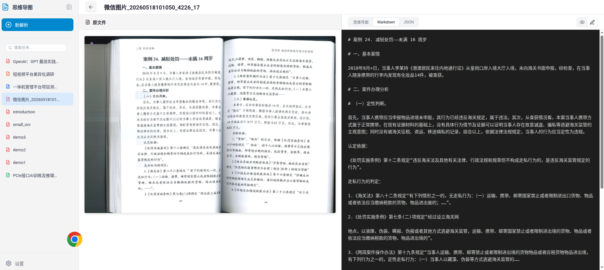

# DocMindLens

将非结构化文档（PDF/图片/Office）转化为 AI 可用的结构化数据

---

## 功能简介

DocMindLens 是一款基于 AI 的智能文档解析系统，能够将扫描件、PDF、图片、Office 文档等非结构化文件转换为结构化的 Markdown、JSON 格式，并支持思维导图可视化展示。

## 核心功能

### 1. 多格式文件解析

支持多种文件格式的智能解析：

| 类型 | 支持格式 |
|------|----------|
| 📄 PDF | `.pdf` |
| 🖼️ 图片 | `.png`, `.jpg`, `.jpeg`, `.webp`, `.gif` |
| 📝 Word | `.docx` |
| 📊 Excel | `.xlsx` |
| 📑 PowerPoint | `.pptx` |

### 2. 原文件预览

提供高保真的原文件预览功能：

- PDF 文件支持逐页渲染和缩放控制
- Office 文档使用原生预览组件
- 图片文件直接展示

### 3. 解析结果展示

解析结果提供三种视图模式：

#### 🔀 思维导图模式

将文档内容自动转化为交互式思维导图：



- 支持鼠标滚轮缩放（0.5x-2x）
- 可导出为 SVG 文件
- 显示节点数量统计
- 支持 AI 总结增强功能

#### 📝 Markdown 预览模式

高保真 Markdown 渲染，支持标题层级、表格、代码块等：



#### 📋 Markdown 编辑模式

深色主题编辑器，支持直接编辑源码：



#### 📊 JSON 数据模式

展示结构化的 JSON 数据，包含文档元素类型、坐标、文本内容等详细信息：



### 4. 多类型文档支持

#### PPT 文档解析



支持 PPT 幻灯片平铺预览，并提取内容生成思维导图。

### 5. 解析配置

通过设置面板可自定义解析参数：



**解析设置：**
- 后端引擎选择（Pipeline / VLM / Hybrid）
- 解析方法（Auto / Text / OCR）
- 语言选择（中文、英文、日文等）
- 页码范围设置
- 公式解析开关
- 表格解析开关
- 图片分析开关

**AI 模型设置：**
- API URL 配置
- API Key 管理
- 模型名称设置
- 自定义提示词

## 技术架构

| 层级 | 技术栈 |
|------|--------|
| 前端框架 | Vue 3 + Vite |
| 状态管理 | Pinia |
| UI 组件 | Element Plus |
| PDF 渲染 | pdfjs-dist |
| Office 预览 | @vue-office |
| 思维导图 | markmap-lib |
| Markdown | markdown-it |
| 图标库 | lucide-vue-next |
| 后端 | FastAPI |

## 项目结构

```
DocMindLens/
├── frontend/          # 前端应用
│   ├── src/
│   │   ├── views/     # 页面视图
│   │   ├── components/ # 组件
│   │   ├── stores/    # 状态管理
│   │   └── services/  # API 服务
│   └── public/        # 静态资源
├── demo/              # 示例文件
├── docs/              # 文档
└── backend/           # 后端服务
```

## 快速开始

### 安装依赖

```bash
cd frontend
npm install
```

### 启动开发服务器

```bash
npm run dev
```

### 构建生产版本

```bash
npm run build
```

## 使用方式

1. 点击"新解析"按钮或拖拽文件到上传区域
2. 系统自动进行解析
3. 解析完成后可查看思维导图、Markdown、JSON 三种格式结果
4. 通过设置面板调整解析参数

## 特性亮点

- ✅ 支持多种文件格式（PDF/图片/Office）
- ✅ 左右分栏对比视图，原文件与解析结果并排展示
- ✅ 交互式思维导图，支持缩放和导出
- ✅ AI 总结增强功能
- ✅ 响应式设计，适配多种屏幕尺寸
- ✅ 多语言支持（中文、英文、日文等）

---

*DocMindLens — 让文档内容为 AI 所用*
