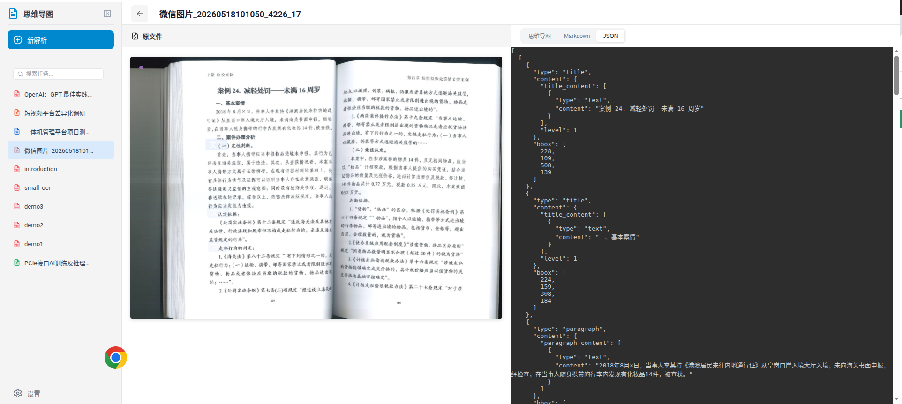

# DocMindLens 智能文档解析系统 — 功能说明文档

---

## 一、核心价值主张

**将非结构化文档转化为 AI 可用的结构化数据。**

DocMindLens 是一款面向 AI 时代的智能文档解析平台，能够将 PDF、图片、Office 文档等多种格式的非结构化内容，高精度地转化为 Markdown、JSON 等结构化输出，为知识库构建、智能问答、模型训练等下游 AI 应用提供高质量的数据基座。


---

## 二、支持的输入格式

DocMindLens 覆盖了文档数字化场景中的主流文件格式，满足从扫描件到原生电子文档的全量解析需求。

| 文档类别 | 支持格式 | 典型场景 |
|---------|---------|---------|
| **PDF 文档** | `.pdf` | 学术论文、技术报告、合同档案、扫描件 |
| **图片** | `.png` `.jpg` `.jpeg` `.webp` `.gif` `.bmp` `.tiff` `.jp2` | 拍照识别、截图 OCR、历史档案数字化 |
| **Word 文档** | `.docx` | 商务文档、政策文件、操作手册 |
| **Excel 表格** | `.xlsx` | 数据报表、统计表格、财务数据 |
| **PPT 演示** | `.pptx` | 培训课件、产品演示、会议材料 |



### 2.1 PDF 文档解析能力

- **文本型 PDF**：精准提取内嵌文本，保留原始排版结构与阅读顺序
- **扫描型 PDF**：通过 OCR 引擎识别扫描图像中的文字内容，支持多语言识别
- **混合型 PDF**：自动检测页面中的文本区域与图像区域，分别采用最优策略处理
- **页码范围选择**：支持指定起始页与结束页，灵活控制解析范围

### 2.2 图片格式支持

- 覆盖 8 种主流图片格式，适配拍照、截图、扫描等各类图像输入场景
- 内置 OCR 光学字符识别，可将图片中的文字区域精准提取为可编辑文本
- 支持图片中的表格、公式等复杂版面元素的识别与结构化还原

### 2.3 Office 文档处理

- **Word (.docx)**：提取文档正文、标题层级、表格、图片等结构化内容
- **Excel (.xlsx)**：解析单元格数据与表格结构，保留行列关系
- **PPT (.pptx)**：逐页提取幻灯片文本、排版信息与视觉元素

---

## 三、解析引擎特性

DocMindLens 提供三大类解析引擎，针对不同精度需求和算力条件灵活适配：

### 3.1 Pipeline 管道解析

传统管道式解析引擎，采用「OCR → 版面分析 → 段落切分 → 结构重组」的多阶段流水线架构。

| 特性 | 说明 |
|------|------|
| 通用性 | 支持多语言 OCR，覆盖中、英、日、韩、阿拉伯语等 16+ 语族 |
| 稳定性 | 基于规则与模型结合，无幻觉风险，结果可预期 |
| 解析方法 | Auto（自动判断）/ Text（纯文本提取）/ OCR（光学识别） |
| 适用场景 | 通用文档解析、批量处理、对幻觉零容忍的正式场景 |

### 3.2 VLM 视觉语言模型

基于视觉语言模型（Vision Language Model）的端到端解析引擎，将文档页面作为图像输入，由大模型直接理解并输出结构化内容。

| 特性 | 说明 |
|------|------|
| 精度 | 高精度理解复杂版面，擅长处理非标准排版 |
| 部署模式 | Auto Engine（本地 GPU 计算）/ HTTP Client（远程 API 调用） |
| 语言支持 | 中英文为主 |
| 适用场景 | 复杂排版文档、手写体识别、高精度要求场景 |

### 3.3 Hybrid 混合模式

融合 Pipeline 与 VLM 的混合解析引擎，结合传统管道的稳定性与视觉模型的高精度，实现优势互补。

| 特性 | 说明 |
|------|------|
| 融合策略 | Pipeline 负责基础结构提取，VLM 负责复杂区域精修 |
| 语言支持 | 多语言（继承 Pipeline 的多语言能力） |
| 部署模式 | Auto Engine（本地 GPU）/ HTTP Client（远程算力 + 少量本地算力） |
| 适用场景 | 追求最高精度的生产级场景、多语言混合文档 |


---

## 四、输出格式

DocMindLens 提供多种结构化输出，满足不同下游应用的数据接入需求：

### 4.1 Markdown 结构化文本

- 保留原文标题层级（H1-H6）、段落结构、列表格式
- 表格以 Markdown Table 语法还原
- 数学公式以 LaTeX 语法输出
- 图片以相对路径引用，保持文档完整性
- 支持预览/编辑双模式切换，编辑后可实时同步至思维导图

### 4.2 JSON 结构化数据

- **Content List JSON**：内容列表格式，按阅读顺序组织文档元素（文本块、表格、图片、公式等），每个元素标注类型与坐标信息
- **Middle JSON**：中间结构化数据，包含版面分析的完整结果，适用于二次开发
- **Model Output JSON**：模型原始输出，保留最完整的解析信息

### 4.3 思维导图可视化

- 基于 Markdown 内容自动生成交互式思维导图
- 支持缩放、拖拽、节点折叠等交互操作
- 一键导出 SVG 矢量图，方便嵌入演示文稿或文档
- AI 总结功能可自动生成文档摘要并渲染为思维导图


---

## 五、核心功能模块

### 5.1 文档上传与管理

- **拖拽上传**：支持将文件直接拖入上传区域
- **点击上传**：点击上传区域选择本地文件
- **多文件支持**：可同时上传多个文件进行批量解析
- **自动解析**：文件上传完成后自动启动解析流程
- **智能图标**：上传区域根据文件类型动态高亮对应格式图标（PDF/Word/Excel/PPT/图片）

### 5.2 多格式预览

系统根据文件扩展名自动选择最优预览组件：

| 文件类型 | 预览方式 | 特性 |
|---------|---------|------|
| PDF | PDF.js 渲染引擎 | 高保真页面渲染、缩放控制、逐页浏览 |
| 图片 | 原生 `` 标签 | 原图展示、自适应缩放 |
| Word (.docx) | @vue-office/docx | 排版还原、样式保留 |
| Excel (.xlsx) | @vue-office/excel | 表格渲染、数据展示 |
| PPT (.pptx) | @vue-office/pptx | 幻灯片逐页展示、4:3 比例还原 |

### 5.3 智能文本提取与排版还原

- 精准识别文档中的文本内容，保留原始阅读顺序
- 还原标题层级、段落缩进、列表结构等排版信息
- 处理多栏排版、跨页段落等复杂版面场景
- 输出格式化的 Markdown 文本，可直接用于 AI 模型输入

### 5.4 表格识别与重构

- 识别文档中的表格区域，提取单元格内容与结构关系
- 还原合并单元格、嵌套表格等复杂表格结构
- 输出为 Markdown Table 或 JSON 结构化数据
- 支持表格解析功能开关，可按需启用

### 5.5 公式识别支持

- 识别文档中的行内公式与独立公式块
- 输出标准 LaTeX 语法，兼容主流数学排版工具
- 支持公式解析功能开关，可按需启用
- 适用于学术论文、教材等含大量数学公式的文档场景

### 5.6 图片分析能力

- 提取文档中嵌入的图片资源，保留原始分辨率
- VLM/Hybrid 引擎支持对图片和图表进行 AI 语义分析
- 生成图片内容描述，增强文档的结构化程度
- 图片以相对路径存储，保持与 Markdown 文本的关联关系


---

## 六、用户界面特性

### 6.1 三栏布局

采用「文件列表 / 源文件预览 / 解析结果」三栏布局，实现原始文档与解析结果的同屏对比：

- **左侧栏**：任务历史列表，支持搜索过滤与任务管理
- **中间区**：源文件实时预览，保留原始排版效果
- **右侧区**：解析结果展示，支持多视图切换

### 6.2 实时解析进度展示

- 任务提交后实时显示解析进度状态
- 任务状态流转：排队中 → 解析中 → 已完成 / 失败
- 支持任务列表的自动刷新与状态同步

### 6.3 多视图切换

右侧解析结果面板提供三种视图模式，通过 Tab 标签页无缝切换：

| 视图模式 | 功能说明 |
|---------|---------|
| **思维导图** | 基于 Markdown 自动生成交互式思维导图，支持缩放、折叠、下载 SVG |
| **Markdown** | 结构化文本预览，支持预览/编辑模式切换，含 AI 总结功能 |
| **JSON** | 展示 content_list_v2.json 结构化数据，适用于开发者与数据工程师 |


### 6.4 任务管理与历史记录

- 任务列表展示所有历史解析记录
- 支持关键词搜索快速定位目标任务
- 鼠标悬停显示删除按钮，支持单任务删除
- 任务自动过期清理（默认 24 小时），释放存储空间
- 点击任务即可加载解析结果，支持快速回溯

### 6.5 解析参数配置

通过侧边抽屉式设置面板，灵活配置解析参数：

- **后端引擎选择**：Pipeline（通用）/ VLM Auto Engine（高精度）/ Hybrid Auto Engine（混合）
- **解析方法选择**：Auto（自动）/ Text（纯文本）/ OCR（光学识别）
- **语言选择**：中文、英文、日语、韩语等 9 种快捷选项
- **页码范围**：指定起始页与结束页
- **功能开关**：公式解析、表格解析、图片分析（均默认开启）
- **一键重置**：恢复默认配置

### 6.6 AI 智能总结

- 基于 OpenAI 兼容 API 的流式文档总结（SSE 实时输出）
- 自动生成文档摘要，可一键替换思维导图内容
- 支持自定义提示词（Prompt），按需调整总结风格
- 本地缓存机制，避免重复请求
- 支持重新生成总结


---

## 七、技术优势

### 7.1 高精度文本识别

- 三大解析引擎协同工作，针对不同文档类型自动选择最优策略
- Pipeline 引擎支持 16+ 语族 OCR，覆盖全球主流语言
- VLM 引擎基于视觉语言模型，具备对复杂版面的深度理解能力
- Hybrid 引擎融合传统管道与视觉模型，实现精度与稳定性的最佳平衡

### 7.2 复杂排版还原

- 精准处理多栏排版、跨页段落、图文混排等复杂版面场景
- 保留标题层级、段落结构、列表缩进等排版语义信息
- 表格结构完整还原，支持合并单元格与嵌套表格
- 数学公式以 LaTeX 语法输出，兼容主流学术排版系统

### 7.3 批量处理能力

- 异步任务队列架构，支持多任务并行处理
- Router 分布式调度层，支持多 GPU Worker 负载均衡
- 自动健康监控与故障恢复，保障长时间稳定运行
- 任务自动过期清理，高效管理存储资源

### 7.4 API 接口支持

提供完整的 RESTful API，支持与第三方系统无缝集成：

| API 类别 | 端点 | 说明 |
|---------|------|------|
| 同步解析 | `POST /file_parse` | 提交文件并等待解析完成 |
| 异步解析 | `POST /tasks` | 提交文件，立即返回 task_id |
| 任务查询 | `GET /tasks/{task_id}` | 查询异步任务状态 |
| 结果获取 | `GET /tasks/{task_id}/result` | 获取解析结果 |
| 结果下载 | `GET /api/download-result/{task_id}` | ZIP 格式批量下载 |
| AI 总结 | `POST /api/ai-summarize` | SSE 流式文档总结 |
| 健康检查 | `GET /health` | 服务状态监控 |

- 支持 CORS 跨域访问，适配前后端分离架构
- GZip 压缩传输，优化大数据量场景的响应速度
- OpenAPI 文档自动生成（Swagger UI / ReDoc）

---

## 八、典型应用场景

### 8.1 文档数字化归档

将纸质文档、扫描件、历史档案批量转化为可检索、可编辑的结构化数据，实现档案的数字化管理与长期保存。适用于政府机关、金融机构、医疗机构等需要大规模文档数字化的场景。

### 8.2 AI 知识库构建

将企业内部文档（规章制度、技术文档、产品手册等）解析为结构化 Markdown/JSON 数据，作为 RAG（检索增强生成）知识库的高质量数据源，显著提升 AI 问答系统的回答准确率与覆盖范围。

### 8.3 智能问答系统训练

从专业领域文档中提取结构化文本与知识三元组，为领域大模型的微调训练提供高质量的语料数据。适用于法律、医疗、金融等垂直领域的智能问答系统建设。

### 8.4 学术论文分析

批量解析学术论文 PDF，提取标题、摘要、正文、参考文献、公式、图表等结构化信息，支撑文献综述自动生成、研究趋势分析、知识图谱构建等学术应用场景。

---

## 九、系统架构概览

```
┌─────────────────────────────────────────────────────────┐
│                    用户浏览器 (Vue 3)                     │
│   ┌──────────┐  ┌──────────────┐  ┌──────────────────┐  │
│   │ 文件列表  │  │  源文件预览   │  │   解析结果展示    │  │
│   │ · 任务管理│  │  · PDF.js    │  │  · 思维导图       │  │
│   │ · 搜索过滤│  │  · @vue-office│  │  · Markdown      │  │
│   │ · 设置面板│  │  · 图片预览   │  │  · JSON          │  │
│   └──────────┘  └──────────────┘  └──────────────────┘  │
└────────────────────────┬────────────────────────────────┘
                         │ REST API
┌────────────────────────▼────────────────────────────────┐
│              FastAPI 服务 (:8000)                         │
│  ┌─────────────────────────────────────────────────┐    │
│  │              AsyncTaskManager                    │    │
│  │         (任务队列 · 并发调度 · 超时管理)           │    │
│  └──────┬──────────┬──────────┬──────────┬─────────┘    │
│         │          │          │          │               │
│  ┌──────▼───┐ ┌────▼────┐ ┌──▼───┐ ┌───▼────┐         │
│  │ Pipeline │ │  VLM    │ │Hybrid│ │ Office │         │
│  │ 管道引擎  │ │视觉模型 │ │混合  │ │文档引擎│         │
│  │(OCR+版面)│ │(端到端) │ │(融合) │ │(docx) │         │
│  └──────────┘ └─────────┘ └──────┘ └────────┘         │
│  ┌─────────────────────────────────────────────────┐    │
│  │  AI 总结服务 · SQLite 持久化 · 静态文件服务       │    │
│  └─────────────────────────────────────────────────┘    │
└─────────────────────────────────────────────────────────┘
                         │
┌────────────────────────▼────────────────────────────────┐
│            Router 分布式调度层 (:8002)                    │
│  ┌─────────────────────────────────────────────────┐    │
│  │  WorkerPool · 负载均衡 · 健康监控 · 自动重启      │    │
│  │  ┌────────┐ ┌────────┐ ┌────────────────┐       │    │
│  │  │GPU:0   │ │GPU:1   │ │ 远程上游服务器   │       │    │
│  │  │Worker  │ │Worker  │ │ (HTTP Client)  │       │    │
│  │  └────────┘ └────────┘ └────────────────┘       │    │
│  └─────────────────────────────────────────────────┘    │
└─────────────────────────────────────────────────────────┘
```

---

## 十、OCR 语言支持

DocMindLens 的 Pipeline 引擎支持 16+ 语族的光学字符识别：

| 语族代码 | 支持语言 |
|---------|---------|
| `ch` | 中文、英文、繁体中文 |
| `ch_lite` | 中文、英文、繁体中文、日文（轻量模式） |
| `en` | 英文 |
| `korean` | 韩文、英文 |
| `japan` | 中文、英文、繁体中文、日文 |
| `chinese_cht` | 繁体中文、英文 |
| `latin` | 法文、德文、意大利文、西班牙文等拉丁语系 |
| `arabic` | 阿拉伯文、波斯文、维吾尔文、乌尔都文 |
| `east_slavic` | 俄文、白俄罗斯文、乌克兰文 |
| `cyrillic` | 西里尔字母语系（俄文、保加利亚文、蒙古文等） |
| `devanagari` | 天城文字母语系（印地文、马拉地文、尼泊尔文等） |
| `ta` / `te` / `ka` | 泰米尔文、泰卢固文、卡纳达文 |
| `th` | 泰文、英文 |
| `el` | 希腊文、英文 |

---

## 十一、部署与配置

### 单节点部署

```bash
mineru-api --host 0.0.0.0 --port 8000
```

### 分布式部署（Router + 多 Worker）

```bash
mineru-router --host 0.0.0.0 --port 8002 --local-gpus 0,1,2 --upstream-url http://gpu-server:8000
```

### 关键环境变量

| 环境变量 | 说明 |
|---------|------|
| `MINERU_DEVICE_MODE` | 强制指定计算设备（CUDA / NPU / MPS / CPU） |
| `MINERU_FORMULA_ENABLE` | 全局公式解析开关 |
| `MINERU_TABLE_ENABLE` | 全局表格解析开关 |
| `MINERU_API_MAX_CONCURRENT_REQUESTS` | API 最大并发请求数 |
| `MINERU_API_OUTPUT_ROOT` | 输出文件根目录 |
| `MINERU_API_ENABLE_FASTAPI_DOCS` | API 文档开关（设为 0 关闭） |

---

*DocMindLens — 让文档和网页内容为 AI 所用*
