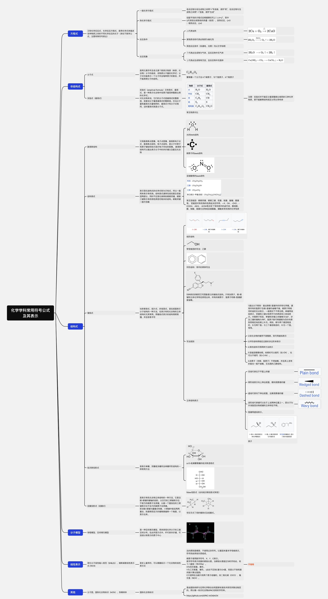

text_image

化学学科常用符号公式
及其表示
方程式
父物化学反应式、化学反应方程式，是用化学式来降低对苯基物之间的不溶性化学反应式(或用于替代)。注意特殊符号表达
一般化学方程式
热化学方程式
反应条件
反应现象
各类反应物与生成物之间就“号流体，请作”和，在反应物与生成物之间构成一直连接，请作“生成”。在配平剂的方法后根据事实写入“△H⁺/°C”，其中（O）表表达应被取值的重量（按定），然后反应，O=0
△代表加热
其他反应条件（如通电、光相）可以文字标明
1 代表此生成物为气体，且反应物内气体量
2 CaOH₂ → CO₂ → CuCO₃ + H₂O
3 H₂O → CH₃
4 H₂O → CH₂O
5 H₂O → CH₂O
6 H₂O → CH₂O
7 H₂O → CH₂O
8 H₂O → CH₂O
9 H₂O → CH₂O
10 H₂O → CH₂O
11 H₂O → CH₂O
12 H₂O → CH₂O
注意：实验式并不超出部分最完整或相同的几种化学物质，更不能解除燃烧区分分异异构体
聚合物：分子式 6 嵌原子、2 天氢原子、6 天氢原子
化合物：分子式 1 分子团团，调整分子量的对称方式，分子式能表示一个分子所各种原子的数目，并不是酸性分子的结构。
双酚类脂肪酸酯结构：电子元素图象，脂肪酸酯电子点式，脂肪酸酯特点图象，电子元素结构，基于中量子离子和碳原子组成而分子子的性质，发展新结构以做出表示分子中的共价键以及配位化合物。
亚硝酸酯的2mm结构：
丙酮、CH₃PO₄
乙二醇、CH₃PO₄
丙二醇、CH₃PO₄
羟己酮(2-甲基胺)、CH₃PO₄(OH)₂
常管脂肪酸酯的共性式为四合形式，所以一般用素表示有机物，脂肪酸酯通常能继续及能直接作用。同时不在生物细胞细胞细胞，顺延三碘脂肪酸酯和有机物表面相切成的结构，碳氧和醚一般可忽略。
线形结构：
邻苯环结构：
烯烃式
出现聚氨酯、异戊烷、铝镁链，易出现聚氨酯分子结构的一种方法。在具有有机化合物的合成材料之前发表，例如通过复合的结构和解毒措施，并且报告书可知。
线形结构：
邻苯环结构：
环氧结构：苯环的两种含义。
S3N结构的可见可能激发过的螺旋式结构，只有会源于、联-键键过过化学特征表达法，并有的碳原子、氢原子和氢-氢键都被替换。
可选规则：
立体结构表示
1.通过分子类别、通过循环型、多循环的特有化学键，通常采用介质子及水系、脂肪的条件下，适用于相同结构的固定态体系，一般情况下不用回溯。单相曲线表示，反向其相互作用下的两条基本三角系数。对能源而言，在单键和同向之间键角为0°，涉及已知的键角为0°。氢原子能采用稀度和均匀的特征控制和应用计算方法。例如，氢原子两个重铬法时，补充两个数；在三个重铬酸酯时，补充一个数。等。
2.如化合物的顺序不是整数，则可用虚线表示
3.环氧结构和反应函数的多边形来表示
4.苯的结构可用两种方法表示
5.可能需要着标膜、粘附时可以填写（ISO-CN），也可以不填写（ISO-CN）。
6.杂原子（锌酸、氢原子）不得精确，并且其上没有的混合是一种精确，又包括的乙醚结构。
线形代表位于平面上的键
线形表示向上伸出圆锥，朝向观察者的键
虚线代表向下伸出圆锥，远距离观察的键
原质代表可以包含上述两种位置之一。即分子为外购混合或缓冲液体特征不规则。
富能弯曲线表示。
7.第二条（苯酚代位） 2.第一条（苯酚代位） 可以取代乙酰胺并取代丙烯基团，取代丙烯基团，取代丙烯基团。
例子
分子模型
球形模型、空间填充模型
线性表示
固定分子特性纳入题目（pM/LKB），维斯威勒线性表示（pM/LKB）
其他
分子图、国际化合物标识（pNCH）、热精铸体
是国际化合物标识
是由国际特级应用化学联合实验室和国家标准技术研究相结合制定的，用以统一相似化合物FMC名称的字母代替。
https://pub.com/pjMC/knCNON

